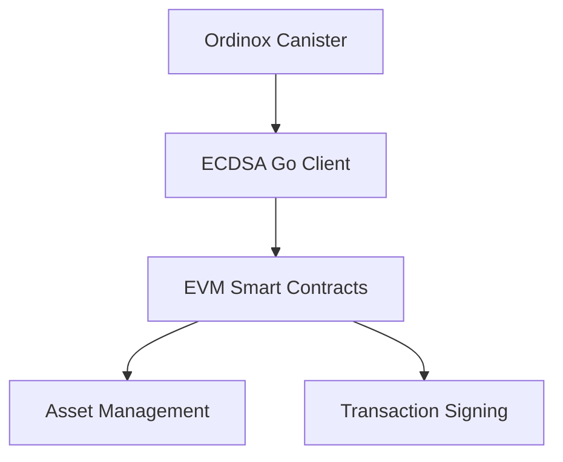

# Ordinox ECDSA

A threshold signing implementation using ECDSA for cross-chain asset management and transaction signing.

## Overview

Ordinox ECDSA consists of three main components:

1. **Ordinox Canister**: Handles threshold signing operations
2. **Ordinox ECDSA Go Client**: Facilitates interaction with the Ordinox Canister
3. **Ordinox EVM Smart Contracts**: Manages EVM assets and processes generated signatures

## Prerequisites

Ensure you have the following installed:

- [dfx](https://smartcontracts.org/docs/quickstart/local-quickstart.html)
- [Go](https://golang.org/doc/install) (latest version)
- [Node.js and npm](https://nodejs.org/)
- [Cargo](https://doc.rust-lang.org/cargo/getting-started/installation.html)

## Installation

1. Clone the repository:

```bash
git clone <repository-url>
cd ordinox-ecdsa
```

2. Install the Internet Computer SDK:

```bash
sh -ci "$(curl -fsSL https://smartcontracts.org/install.sh)"
```

3. Verify dfx installation:

```bash
dfx --version
```

## Setup and Testing

### 1. Start Local ICP Instance

```bash
dfx start --background --clean
```

### 2. Deploy Ordinox Canister

```bash
dfx deploy ordinox_ecdsa
```

After deployment, copy the Canister ID and update it in `client/tecdsa_test.go` (line 15).

### 3. Run Go Client Tests

```bash
go test ./client -v count=1
```

This test:

- Connects to the deployed Ordinox Canister
- Creates a signing request
- Signs using 3 temporary validator keys
- Verifies signature using ecrecovery

Important: Copy the signature and chain-key-address from the test output - you'll need these for the next step.

### 4. Test Smart Contract Integration

1. Update the signature and chain-key-address in `test/ordinox-ecdsa.ts` with the values from the previous step.

2. Run the Hardhat tests:

```bash
npx hardhat test
```

The test will output the EVM address of the chain key assigned to the Ordinox Canister, confirming successful integration.

## Architecture



## Future Development

1. Integration with Ordinox Chain
   - Implementation of transaction signing for Ordinox Vaults across various chains
2. Non-EVM Chain Support
   - Extension of signing methodologies to support non-EVM blockchain networks

## Common Issues and Troubleshooting

1. If dfx deployment fails:
   - Ensure your dfx.json is properly configured
   - Check that the local ICP instance is running
2. If Go tests fail:
   - Verify the Canister ID is correctly updated in the test file
   - Ensure all dependencies are installed

## Contributing

Please read our contributing guidelines before submitting pull requests.

## License

[Add License Information]
