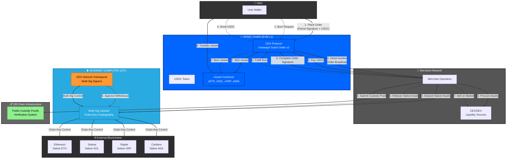

# ODX Protocol - Technical Documentation

## Overview

ODX is a blue-chip crypto wrapper protocol that enables users to gain exposure
to major cryptocurrencies (ETH, SOL, XRP, ADA) through synthetic assets
(xAssets) backed 1:1 by real assets held in secure custody. The protocol
leverages Sonic's high-performance EVM chain for transaction execution and ICP's
chain-key cryptography for secure multi-chain asset custody.

## Core Components

### 1. Sonic Chain Layer (EVM Component)

- **xAsset Smart Contracts**: ERC-20 compatible wrapped assets (xETH, xSOL,
  xXRP, xADA) deployed on Sonic
- **ODX Protocol Contracts**: Implementation of UniswapX Dutch Order v2 for
  gasless, MEV-protected order fulfillment
- **USDC Settlement**: Users pay and receive USDC on Sonic for minting and
  burning operations

### 2. ICP Custody Layer

- **Chain-Key Cryptography**: Enables ICP canisters to directly control native
  addresses on external blockchains (Bitcoin, Ethereum, Solana, Cardano, Ripple)
- **Multi-Signature Canister**: Custodies all native assets with approval
  required from ODX Network Participants
- **Cross-Chain Security**: Assets remain secure on their native chains while
  controlled by the decentralized ICP canister

### 3. Merchant Network

- **Order Fulfillment**: Merchants monitor and fulfill user orders via Dutch
  auction mechanism
- **Asset Procurement**: Merchants source assets from CEXs, DEXs, or other
  liquidity venues
- **Custody Submission**: Merchants deposit procured assets to ICP
  canister-controlled addresses
- **Proof Submission**: Merchants submit publicly verifiable proofs of custody
  to ODX protocol

### 4. ODX Network Participants

- **Multi-Sig Signers**: Decentralized set of signers controlling the ICP
  canister
- **Consensus Requirement**: All participants must approve before funds can be
  withdrawn from custody
- **Security Model**: Prevents single points of failure and unauthorized asset
  movements

## Protocol Flow

```mermaid
graph TB
    subgraph User["👤 User"]
        U[User Wallet]
    end
    
    subgraph Sonic["🔷 SONIC CHAIN (EVM L1)"]
        USDC[USDC Token]
        xAssets[xAsset Contracts<br/>xETH, xSOL, xXRP, xADA]
        ODX_Contract[ODX Protocol<br/>UniswapX Dutch Order v2]
    end
    
    subgraph Merchant["🏪 Merchant Network"]
        M[Merchant Operators]
        CEX[CEX/DEX<br/>Liquidity Sources]
    end
    
    subgraph ICP["🌐 INTERNET COMPUTER (ICP)"]
        Canister[Multi-Sig Canister<br/>Chain-Key Cryptography]
        ODX_Network[ODX Network Participants<br/>Multi-Sig Signers]
    end
    
    subgraph External["⛓️ External Blockchains"]
        ETH_Chain[Ethereum<br/>Native ETH]
        SOL_Chain[Solana<br/>Native SOL]
        XRP_Chain[Ripple<br/>Native XRP]
        ADA_Chain[Cardano<br/>Native ADA]
    end
    
    subgraph OffChain["📋 Off-Chain Infrastructure"]
        Proofs[Public Custody Proofs<br/>Verification System]
    end
    
    %% Minting Flow
    U -->|"1. Place Order<br/>(Partial Signature + USDC)"| ODX_Contract
    ODX_Contract -->|"2. Dutch Auction<br/>Order Broadcast"| M
    M -->|"3. Procure Assets"| CEX
    M -->|"4. Deposit Native Assets"| Canister
    
    Canister -->|"Chain-Key Control"| ETH_Chain
    Canister -->|"Chain-Key Control"| SOL_Chain
    Canister -->|"Chain-Key Control"| XRP_Chain
    Canister -->|"Chain-Key Control"| ADA_Chain
    
    M -->|"5. Submit Custody Proof"| Proofs
    M -->|"6. Complete Order Signature"| ODX_Contract
    ODX_Contract -->|"7. Mint xAsset"| xAssets
    xAssets -->|"8. Transfer xAsset"| U
    ODX_Contract -->|"9. Pay USDC"| M
    
    %% Burning Flow (thicker dashed lines)
    U -.->|"1. Burn Request"| ODX_Contract
    ODX_Contract -.->|"2. Burn xAsset"| xAssets
    M -.->|"3. Fulfill Burn"| ODX_Contract
    ODX_Contract -.->|"4. Send USDC"| U
    ODX_Network -.->|"5. Approve Withdrawal"| Canister
    Canister -.->|"6. Release Native Asset"| M
    M -.->|"7. Sell on Market"| CEX
    
    %% Security Layer
    ODX_Network -->|"Multi-Sig Control"| Canister
    
    style Sonic fill:#0066FF,stroke:#003399,stroke-width:3px,color:#fff
    style ICP fill:#29ABE2,stroke:#1a7db8,stroke-width:3px,color:#fff
    style Canister fill:#29ABE2,stroke:#1a7db8,stroke-width:2px,color:#fff
    style ODX_Network fill:#ff9933,stroke:#cc7700,stroke-width:2px,color:#000
    style External fill:#2d2d2d,stroke:#1a1a1a,stroke-width:2px,color:#fff
    style ODX_Contract fill:#0066FF,stroke:#003399,stroke-width:2px,color:#fff
    style xAssets fill:#0066FF,stroke:#003399,stroke-width:2px,color:#fff
    style Proofs fill:#90EE90,stroke:#4d994d,stroke-width:2px,color:#000
    style User fill:#333,stroke:#000,stroke-width:2px,color:#fff
    style Merchant fill:#555,stroke:#000,stroke-width:2px,color:#fff
    style OffChain fill:#666,stroke:#000,stroke-width:2px,color:#fff

    linkStyle default stroke:#333,stroke-width:2px
```

### Minting xAssets

1. **Order Placement**: User creates a partially signed order on Sonic
   specifying desired asset (ETH/SOL/XRP/ADA) and USDC payment amount
2. **Order Discovery**: Merchant monitors Dutch auction orders and selects
   profitable fulfillment opportunities
3. **Asset Procurement**: Merchant acquires the underlying asset from external
   liquidity sources (CEX/DEX)
4. **Custody Deposit**: Merchant sends native asset to ICP canister-controlled
   address on the respective blockchain
5. **Proof Submission**: Merchant submits custody proof to ODX protocol (managed
   off-chain, made public)
6. **Order Completion**: Merchant signs the order to complete fulfillment
7. **xAsset Minting**: ODX protocol mints corresponding xAsset to user's address
   on Sonic
8. **USDC Transfer**: User's USDC payment is transferred to merchant as
   compensation

### Burning xAssets

1. **Burn Request**: User initiates burn of xAsset on Sonic to exit position
2. **Order Matching**: Merchant takes the opposite side of the burn order
3. **xAsset Burn**: Protocol burns user's xAsset tokens on Sonic
4. **USDC Settlement**: User receives USDC at current market rate
5. **Asset Withdrawal**: Merchant withdraws underlying asset from ICP canister
   (requires ODX Network Participants approval)
6. **Market Sale**: Merchant sells withdrawn asset on external markets to
   replenish USDC reserves

## Key Features

### Gasless Transactions

UniswapX Dutch Order v2 implementation enables users to submit orders without
paying gas fees upfront, improving UX and accessibility.

### MEV Protection

Dutch auction mechanism and off-chain order matching protect users from
front-running and sandwich attacks common in DeFi protocols.

### Decentralized Custody

ICP's chain-key cryptography enables trustless custody of native assets without
centralized custodians or wrapped token bridges.

### Multi-Chain Native Support

Unlike traditional bridge-based wrappers, ODX custodies actual native assets
(real ETH, SOL, XRP, ADA) rather than bridge-wrapped versions.

### Transparent Verification

All custody proofs are publicly available, enabling users to verify 1:1 backing
of xAssets at any time.

## Future Roadmap

### Cross-Chain Expansion

ODX plans to become chain-agnostic, allowing users to mint and burn xAssets from
any supported blockchain while maintaining unified custody on ICP.

### Additional Asset Support

Protocol will expand beyond blue-chip cryptocurrencies to support additional
high-quality digital assets based on merchant network capacity and user demand.

## Security Model

**Asset Custody**: All underlying assets are held in ICP canister addresses
secured by chain-key cryptography, requiring consensus from ODX Network
Participants for any withdrawals.

**Order Execution**: Dutch auction mechanism ensures competitive pricing while
protecting users from MEV exploitation.

**Merchant Incentives**: Merchants are economically incentivized to fulfill
orders honestly as they profit from the spread between procurement cost and USDC
payment.

**Public Verifiability**: Custody proofs and canister state are publicly
auditable, enabling community oversight of protocol solvency.

## Technical Stack

- **Smart Contract Chain**: Sonic (high-performance EVM L1)
- **Custody Infrastructure**: Internet Computer Protocol (ICP)
- **Order Protocol**: UniswapX Dutch Order v2 (custom implementation)
- **Settlement Currency**: USDC
- **Supported Assets**: ETH, SOL, XRP, ADA (with more planned)

---

_For more information about ODX Protocol, visit [odx.so] or join our community
at [https://discord.gg/odex]_
